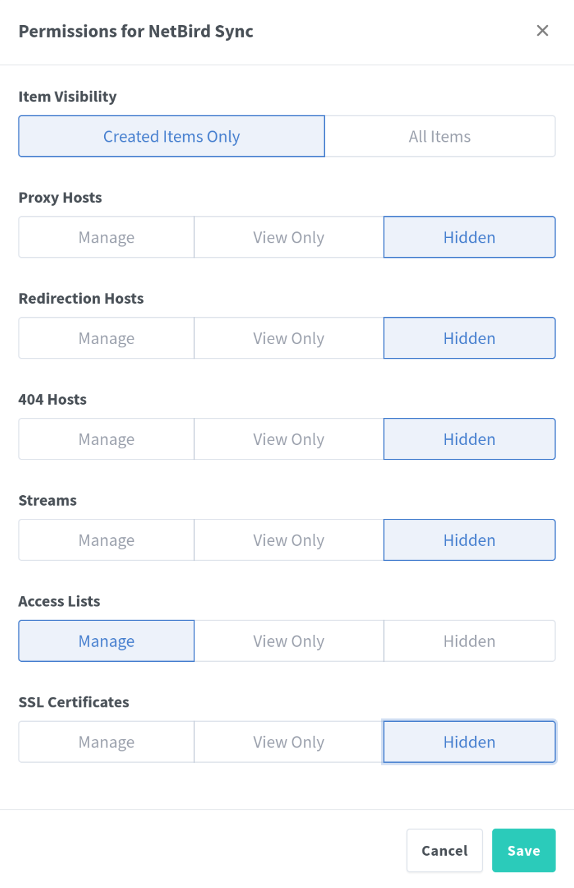

# Netbird NPM Sync Service
This python service is used to sync group permissions from Netbird to Nginx Proxy Manager (NPM) using both API.

## Table of Contents
- [Usage](#usage)
- [Environment Variables](#environment-variables)
- [Other](#other)


## Usage
You can run this service in a docker container or directly on your host machine.

### Docker
`docker-compose.yaml`
```yaml
services:
  npm:
    image: 'jc21/nginx-proxy-manager:latest'
    container_name: 'npm'
    ...
    healthcheck:
      test: ['CMD', '/usr/bin/check-health']
      interval: '10s'
      timeout: '3s'


  netbird-sync:
    image: 'ghcr.io/c4mill3/netbird-npm-sync:latest'
    container_name: 'netbird-sync'
    restart: on-failure:3
    volumes:
      - './config.yaml:/app/config.yaml:ro'
    depends_on:
      npm:
```

`config.yaml`
```yaml
netbird:
  api_url: "https://sub.domain.com/api"
  token: "X"
  group_whitelist:
    - "home-*"
    - "admin"ù

npm:
  api_url: "http://npm:81/api"
  username: "nb-sync@home.lab"
  password: "X"
  group_rule_excep:
    nb-groupname:
      - "192.168.1.0/24"

refresh_every_minutes: 30

socket:
  enable: true
  limit_per_hour: 10
  port: 8080
```


### Run directly
You need to setup Env Variable
```bash
git clone https://github.com/C4mill3/netbird-npm-sync.git
python3 -m venv .venv
source .venv/bin/activate
pip install -r requirements.txt
python3 code/main.py
``` 

##  Config Variables
> `config.yaml` should be mounted as a volume at path `/app/config.yaml`

> Mandatory variables are:
> * netbird: `api_url`, `token`
> * npm: `api_url`, `username`, `password`

### netbird
* `api_url`: The Netbird API URL. exemple: `https://netbird.domain.com/api` or `https://api.domain.com`
* `token`: Your Netbird token. See [Get an API Netbird Token](#get-an-api-netbird-token).
* `group_whitelist`: Should be in list format, you can use joker cards. exemple: `/home*` or `admin`

### npm
* `api_url`: The NPM API URL. exemple:  priority to internal: `http://DOCKER_NAME:81/api` or could be `https://npm.domain.com/api`
* `username`: npm user email, you should create a user with `ACL` permission. See [Recommended Permissions](#recommended-account-permissions-for-nginx-proxy-manager).
* `password`: npm user password
* `group_rule_excep`: The ip will be able to access everything, should be in dict format, you can precise submask.exemple: `{group1:["192.168.1.0/24", ...]}`

### socket 
* `enable`: if set, enable a socket server where npm or user could request a refresh. Default is disabled (false)
* `limit_per_hour`: set a limit of hourly requests. Default is `10` but default is also disabled.
* `port`: port socket should run on the container. Default is 8080.


### Other
* `RUN_EVERY_MINUTES`: How often the `ACL` should be updated, in minutes. Default is `30`. If you want to run it only at start, set it to `0`.


You can find npm api doc in: `https://npm.domain.com/api/schema`.


## Other

### Recommended Account Permissions for Nginx Proxy Manager


### Get an API Netbird Token
Go to your Netbird dashboard then `Team` -> `Service Users` -> `Create Service User` and now `Create Access Token`
